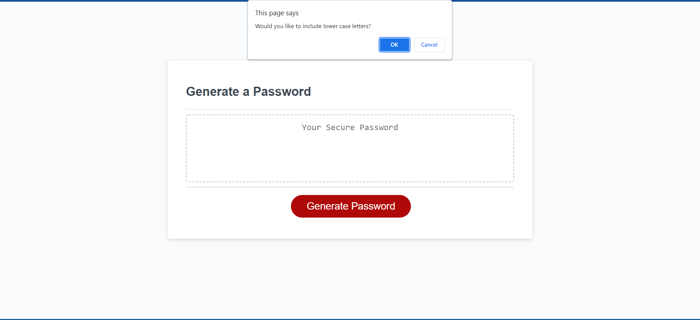
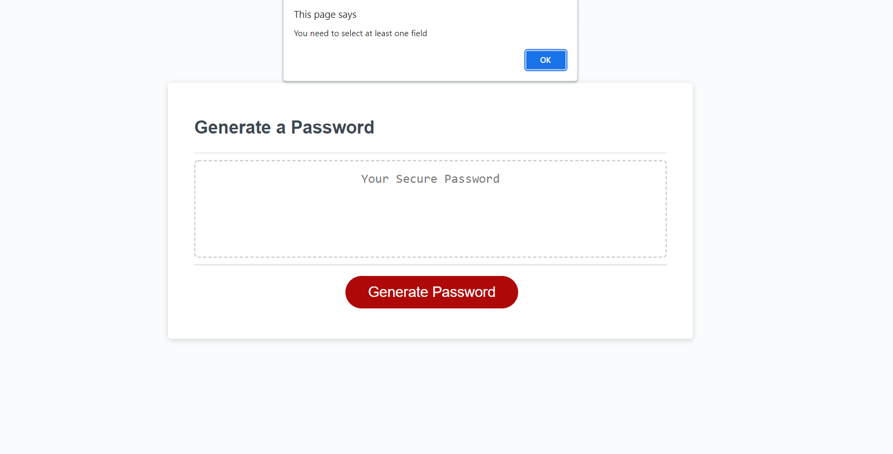
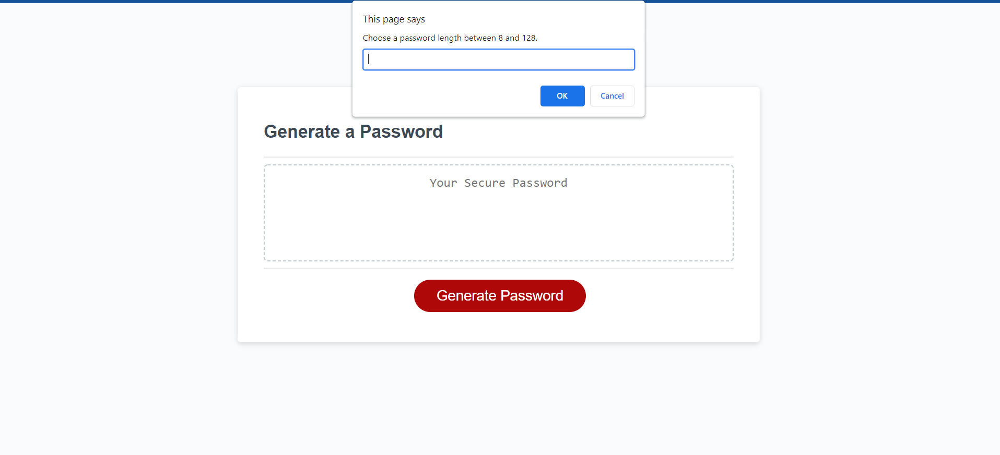
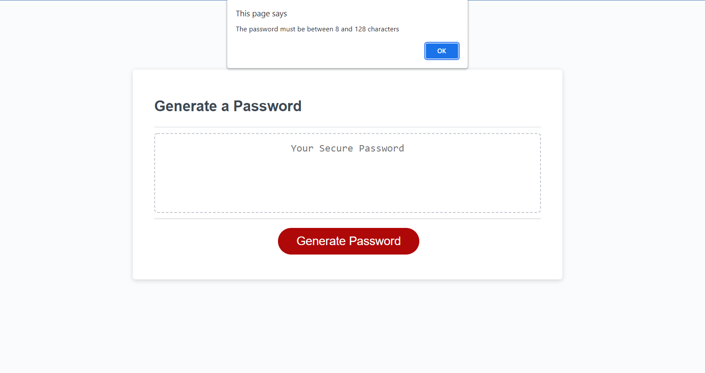
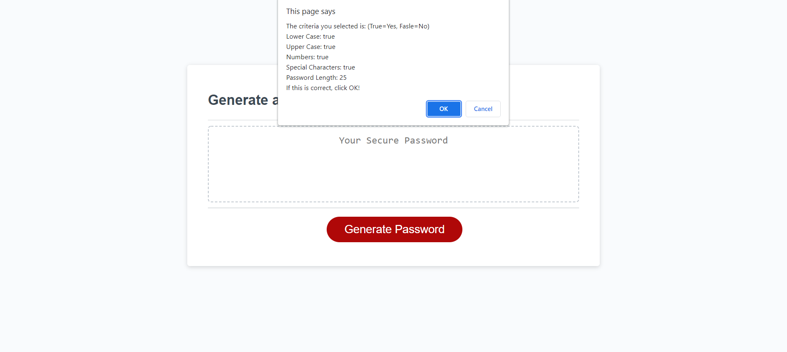
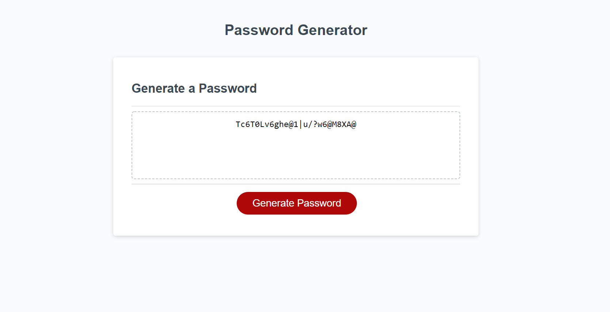

# password-generator

## Description

The goal of this generator is to create a password based on user input criteria. The user chooses the length of the password and the types of characters to include in the password. Once confirmed, the generator uses the input to randomly select the specified number of letters/characters from each of the selected criteria. It then shuffles their order and displays the newly generated password on the screen. By using a 2D array, I was able to ensure that there would be at least one of each selected character type. The user is able to verifiy all criteria selected before the password is generated. If the user doesn't select any options or inputs a length out of range, they are notified and the generator restarts the relative section of the criteria selection. The generator can be ran multiple times in a row without fail. I learned how to effectively structure and call functions in a javascript file. I also learned how to break out of nested loops utilizing labels and breaks.testing

## Table of Contents
- [Installation](#installation)
- [Usage](#usage)
- [Credits](#credits)
- [License](#license)
- [Features](#features)
- [Footer](#badges)

## Installation   
N/A

## Usage
Here is the deployed link to the password generator I created. [passwordGenerator](https://maxstump13.github.io/password-generator/)

This is what the generator looks like. 

Once the generate password button is clicked, a series of confirm popups will appear to select the criteria as seen below. 

If no criteria is selected, the following alert will appear. Then the criteria selection will restart. 

Once the criteria is selected, the following prompt will appear requesting a password length between 8 and 128. 

If an invalid number or cancel is clicked, an alert will appear and the prompt will reappear. 

After the length is input, a confirmation window will appear for the user to verify. If the user wants to change the criteria, hit cancel and the generator will go back to the criteria selection portion. 

Finally once the criteria and length are confirmed, the generator creates a password based on the input and displays it in the box. 

## Credits
1. [w3schools](https://www.w3schools.com/default.asp)
2. [MDN](https://developer.mozilla.org/en-US/)
3. [stackoverflow](https://stackoverflow.com/)
4. [CodeSpeedy](https://www.codespeedy.com/shuffle-characters-of-a-string-in-javascript/)
5. [Youtube](https://www.youtube.com/watch?v=9sT03jEwcaw)

## License
[License](./LICENSE)

## Badges
N/A

## Features
1. Clickable generate buttom
2. Confirm and prompt popups to select specific password criteria and length
3. Loops that verify criteria is selected and length is in range
4. Confirmation prompt and loop for user to confirm selected data is correct
5. Loop that randomly selects characters from 2D array of character type and characters
6. Shuffle function that rearranges random characters and outputs them as a string
7. Password is displayed in box on the screen

## How to Contribute
If there are any suggestions to improve this generator, this is my [GitHub](https://github.com/MaxStump13) account. 

## Tests
I tested the password generator by inputing password lengths outside of the designated range and selecting no criteria. The loops and prompts I put into the function worked correctly, making the user input valid values again. I also confirmed the verification loop works correctly